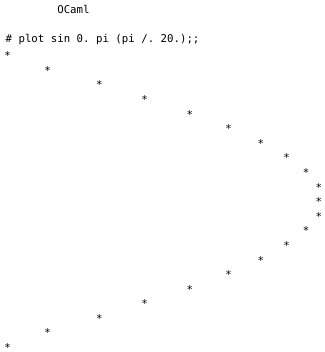

# Question 14.5

> Now write a function `plot` which, given a function of type `float → float`, a range, and a step size, uses star to draw a graph.
> For example, assuming the existence of the name `pi` for $π$, we might see:
>   
> Here, we have plotted the sine function on the range $0 \ldots π$ in steps of size $π/20$. You can define $π$ by calculating `4.0 *. atan 1.0`.

---

We separate the overall problem into two independent subproblems:
- Generate from the given data a list of function values.
- Plot a `float list` as a graph.

We generate the list of function values as follows:
```ocaml
let rec inputs a b step =
  if a > b
  then []
  else a :: inputs (a +. step) b step

let outputs f a b step =
  map f (inputs a b step)
```

To plot a `float list` we first normalize all entries to lie between 0 and 1, and then use the function `star` from the previous exercise to plot each normalized value.

Normalization is done as follows:
```ocaml
let rec fold_aux binop l acc =
  match l with
  | [] -> acc
  | h :: t -> fold_aux binop t (binop h acc)

let fold binop l =
  match l with
  | [] -> raise (Invalid_argument "fold")
  | h :: t -> fold_aux binop t h

let max_lst l =
  fold Float.max l

let min_lst l =
  fold Float.min l

let normalize l =
  match l with
  | [] -> []
  | _ ->
    let min = min_lst l in
    let max = max_lst l in
    let width = max -. min in
    if width = 0. then map (fun _ -> 0.5) l
    else
      let n x = (x -. min) /. width in
      map n l
```

Plotting is then done as follows:
```ocaml
let plot_lst values =
  iter star (normalize values)
```

Finally, we combine everything to plot function values:
```ocaml
let plot f a b step =
  plot_lst (outputs f a b step)
```

We can now plot functions:
```ocaml
# plot sin 0. Float.pi (Float.pi /. 20.);;
*
       *
               *
                      *
                             *
                                   *
                                        *
                                            *
                                               *
                                                 *
                                                 *
                                                 *
                                               *
                                            *
                                        *
                                   *
                             *
                      *
               *
       *
*
- : unit = ()
```
